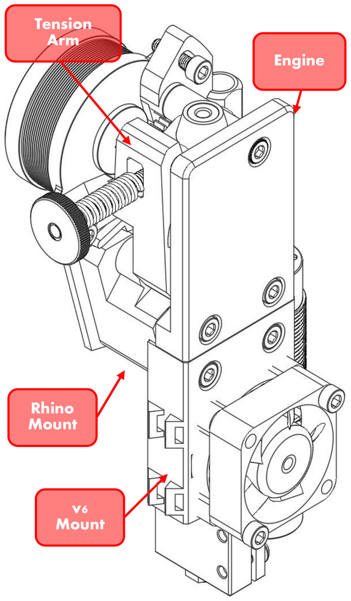
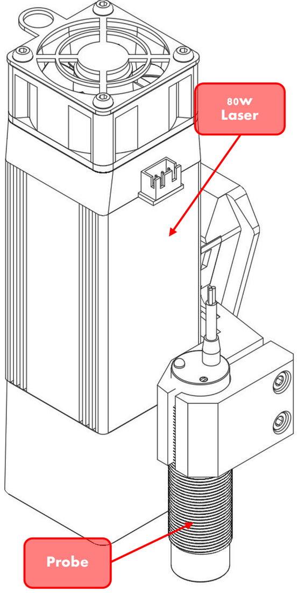
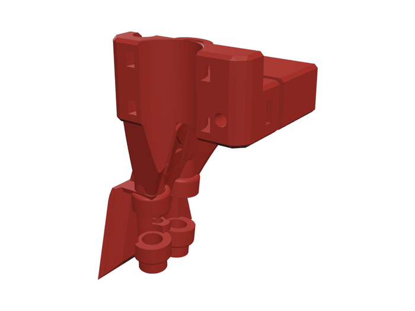
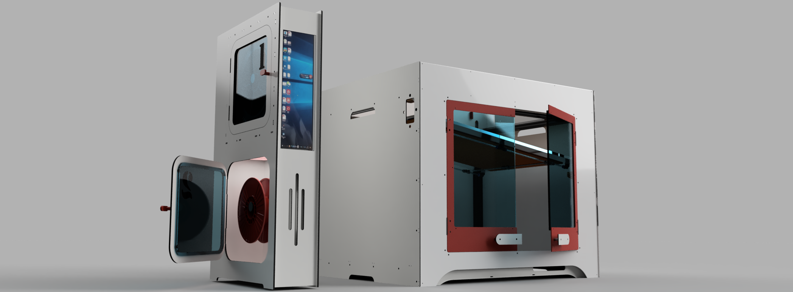

  

<h1 align="center">Rhino Motion System</h1>

  <b>An open-source, multi-tool CoreXY machine for 2D and 3D making.</b> 
  One gantry, five swappable toolheads - 3D printing, laser, CNC spindle and drag knife - controlled by Klipper.

  
  
  
  

  <b>This repo:</b> the machine - CAD, drawings and build notes &nbsp;·&nbsp;
  <b><a href="https://github.com/Makersmic/Toolhead_Manager">Toolhead_Manager</a>:</b> the software - Klipper config, macros, portal and user manual

## The toolheads

<table align="center"><tr><td align="center"><a href="toolheads/blockone/"><picture><source media="(prefers-color-scheme: dark)" srcset="toolheads/blockone/images/blockone-dark.png"></picture></a></td><td align="center"><a href="toolheads/switchfly/"><picture><source media="(prefers-color-scheme: dark)" srcset="toolheads/switchfly/images/switchfly-dark.png"></picture></a></td><td align="center"><a href="toolheads/lightsaber/"><picture><source media="(prefers-color-scheme: dark)" srcset="toolheads/lightsaber/images/lightsaber-dark.png"></picture></a></td><td align="center"><a href="toolheads/hotjoe/"><picture><source media="(prefers-color-scheme: dark)" srcset="toolheads/hotjoe/images/hotjoe-dark.png"></picture></a></td><td align="center"><a href="toolheads/dragknife/"><picture><source media="(prefers-color-scheme: dark)" srcset="toolheads/dragknife/images/dragknife-dark.png"></picture></a></td></tr><tr><td align="center"><a href="toolheads/blockone/"><b>BlockOne</b></a> 3D printing</td><td align="center"><a href="toolheads/switchfly/"><b>SwitchFly</b></a> Dual extrusion</td><td align="center"><a href="toolheads/lightsaber/"><b>LightSaber</b></a> 80 W laser</td><td align="center"><a href="toolheads/hotjoe/"><b>HotJoe</b></a> CNC spindle</td><td align="center"><a href="toolheads/dragknife/"><b>DragKnife</b></a> Drag knife</td></tr></table>

Tools slot into a V-groove on the X-carriage and plug into a 21-pin umbilical at the back of the frame, so each tool
carries only the wiring it needs. [More about the toolheads and the umbilical &rarr;](toolheads/)

## Key features

- **Swappable toolheads** with one M3 bolt and a 21W4 umbilical connector
- **CoreXY with 15 mm belts** on X and Y, and the "Bulkup" XY joiners
- **Three-point Z** - three belt-driven leadscrews with kinematic couplings, trammed by Klipper
- **All-purpose vacuum bed** with air-gap insulated heated plate
- **Enclosed build chamber** with ACP panels and doors
- **Fresh air** - part cooling for printing, blow-air for the laser, chip clearing for the spindle
- **Klipper firmware** on a BTT Octopus, with DIN-rail relays for every heavy load
- **Tool Manager portal** - safe tool swaps, a page for every tool and maintenance tracking ([Toolhead_Manager](https://github.com/Makersmic/Toolhead_Manager))

 
The Tool Manager portal, from <a href="https://github.com/Makersmic/Toolhead_Manager">Toolhead_Manager</a>

## What's in this repo

| Folder | What's there |
|---|---|
| [frame](frame/) | Frame assembly (2020/2040/2060 extrusion and flat bar), drawing, STEP; [panels](frame/panels/) - ACP enclosure, doors, front spacers |
| [motion/xy](motion/xy/) | XY joiners, [X-carriage](motion/xy/x-carriage/), stepper mounts, rear idler, belt tensioners, router templates |
| [motion/z](motion/z/) | Leadscrew carriages and Z stepper mounts |
| [bed](bed/) | Vacuum bed heat spreader |
| [toolheads](toolheads/) | [BlockOne](toolheads/blockone/), [SwitchFly](toolheads/switchfly/), [LightSaber](toolheads/lightsaber/), [HotJoe](toolheads/hotjoe/), [DragKnife](toolheads/dragknife/), and the legacy [Jack Rabbit](toolheads/jack-rabbit/) |
| [electrical](electrical/) | Controller, relays, distribution, umbilical and wiring diagrams |
| [filament-box](filament-box/) | "Cheeky Monkey" roll stand and runout switch (unfinished) |
| [docs](docs/) | [Software](docs/apps.md), [safety](docs/safety.md), [maintenance](docs/maintenance.md), [welcome page PDF](docs/rhino-welcome-page.pdf) |
| [archive](archive/) | 2023 firmware and app notes, kept for reference only |

**Software, config and the user manual** are in **[Toolhead_Manager](https://github.com/Makersmic/Toolhead_Manager)**: the Klipper/Mainsail config package
with a menu installer, the Tool Manager portal, OrcaSlicer profiles and the full user manual (PDF).

## Roadmap

- **BlockOne build files** - [folder ready](toolheads/blockone/)
- **SwitchFly build files**
- **Touch-probe Z setting** for the laser, spindle and drag knife
- **Kiri:Moto** for laser, drag-knife and CNC jobs from one interface
- **Project "Cheeky Monkey"** - a modular filament box: filament monitoring, air handling, chip exhaust, liquid cooling
- **Smoke detection** wired into Klipper ([safety](docs/safety.md))
- **Machine profiles** so other builders can use the Tool Manager on their own machines
- **Small build-farm management**

This is an ever-evolving project. Expect updates as parts are improved or corrected.

