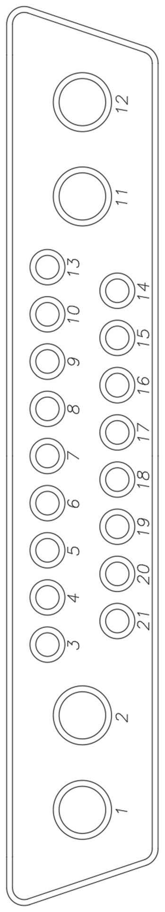
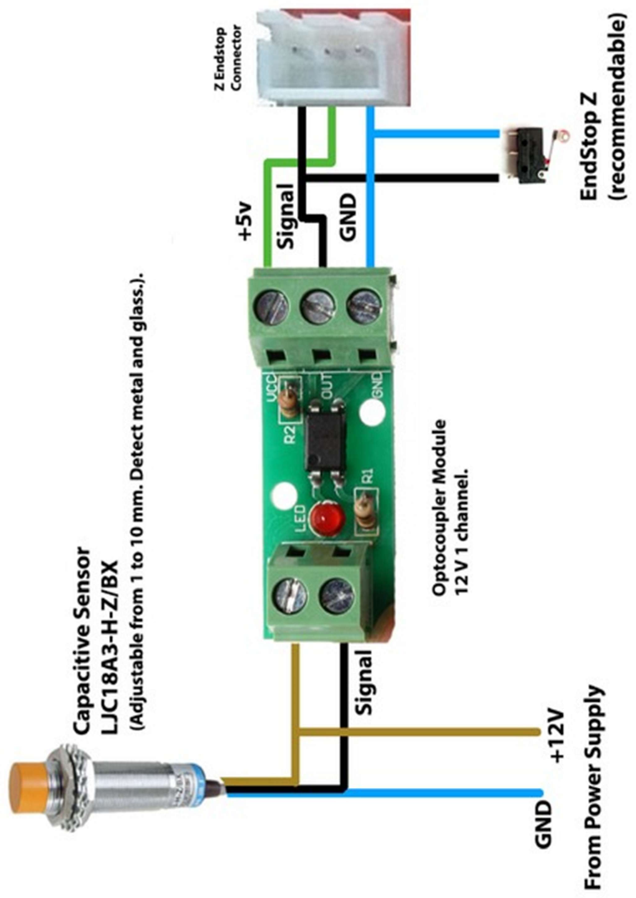
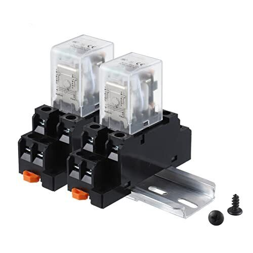
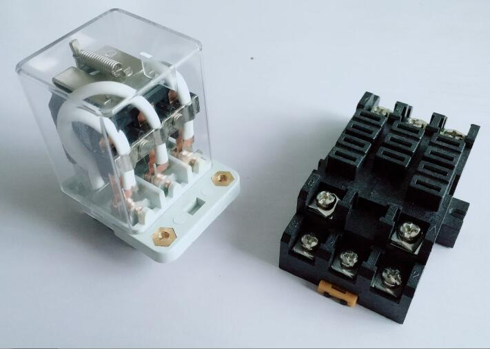
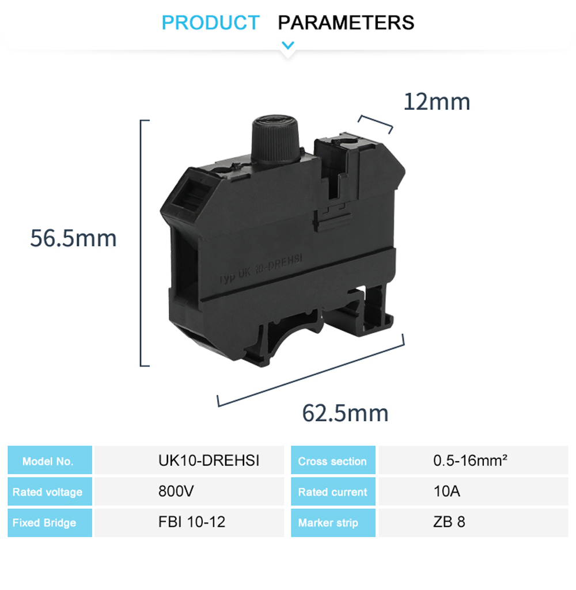
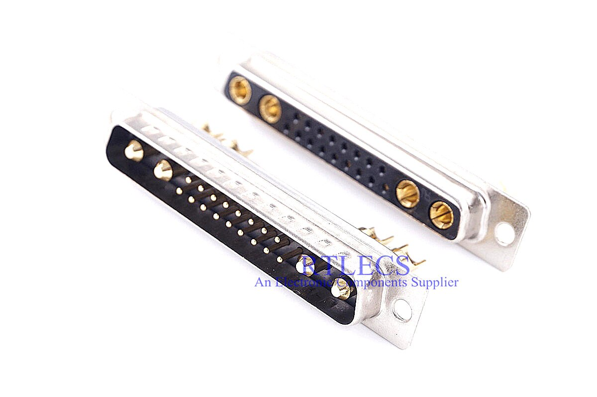

# Electrical

&nbsp;&nbsp;

## Controller

| Part | Current hardware |
|---|---|
| Mainboard | **BTT Octopus v1.1** (replaced the SKR GTR + M5 used in the 2023 build) |
| Klipper host | Raspberry Pi running Klipper, Moonraker and Mainsail |
| Power | Separate 24 V, 12 V and 5 V supplies |

The pin numbers for every tool are in the [toolhead pages](../toolheads/) and in the user manual in
[Toolhead_Manager](https://github.com/Makersmic/Toolhead_Manager). The old pin-assignment PDF for the GTR board has been removed.

## Relays

DIN-rail relays switch every heavy load, which keeps high currents off the board and makes a failed relay a quick
swap. Mechanical relays are easier to troubleshoot, and the click is reassuring; the heated bed mats use SSRs.

| Circuit | Relay |
|---|---|
| 12 V low current: LED and NeoPixel lighting, fans | 700-TBR24 6 A |
| 12 V high current: laser module, vacuum pump | JQX-13FL 10 A |
| 24 V high current: spindle (ESC power) | JQX-38F 40 A |
| Heated bed mats | Solid-state relays |

 

## Distribution and protection

- **Umbilical interface (the Hub):** Wago-style blocks that can't be bridged.
- **Power distribution:** traditional distribution blocks that can be bridged.
- **DIN-rail fuse holders:** protect the stepper motor lines against shorts.

 

## Umbilical

Male/female **21W4 D-sub** connectors; the cable is braided Cat5 plus two 14 AWG conductors. See
[toolheads](../toolheads/#the-umbilical-and-the-hub) for what each contact carries.

## Wiring diagrams

| Diagram | |
|---|---|
| Capacitive Z probe through the optocoupler (mounted in the cabinet) | [wiring-probe-optocoupler.png](images/wiring-probe-optocoupler.png) |
| 4-pin PWM fan | [wiring-4pin-fan.png](images/wiring-4pin-fan.png) |
| HotJoe ESC | [wiring-hotjoe-esc.png](images/wiring-hotjoe-esc.png) |
| SwitchFly servo | [wiring-switchfly-servo.png](images/wiring-switchfly-servo.png) |
