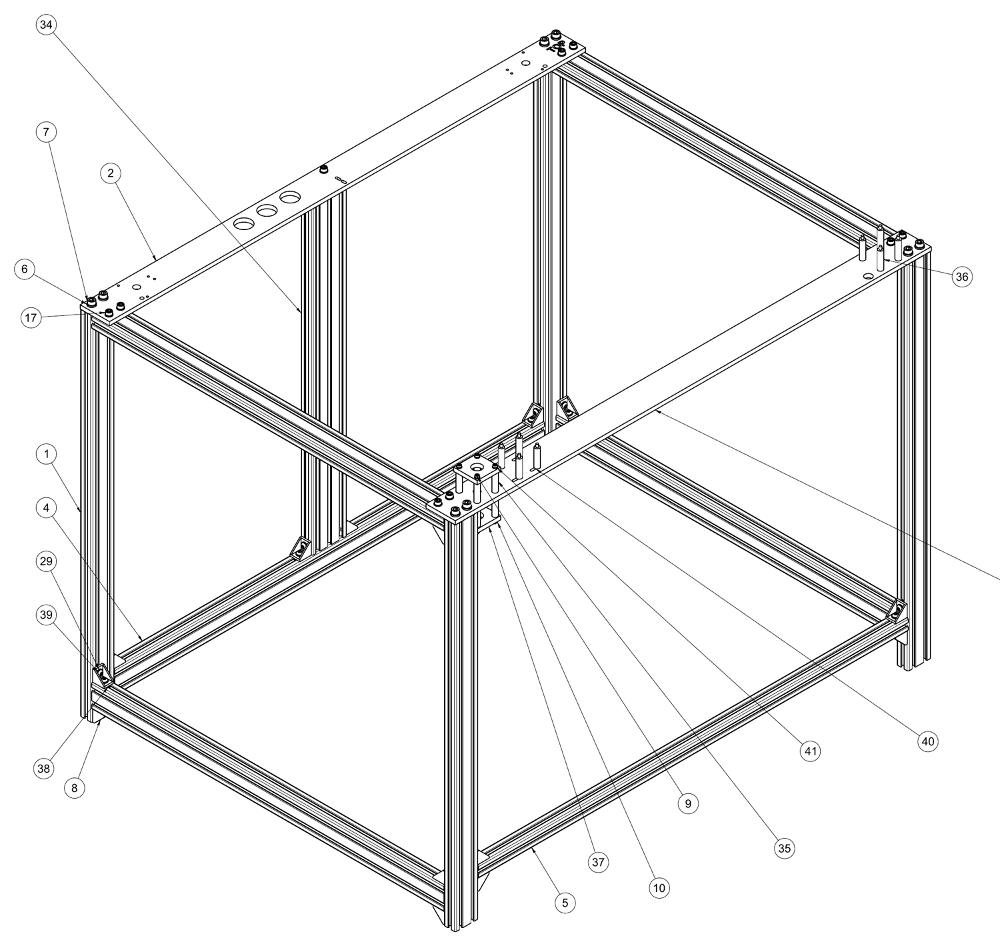

## The Frame

The Rhino utilizes aluminum extrusions based on the popular 2020, 2040, 2060 specification and 0.25" x 2" aluminum flat bar among other standard fasteners.  

### Designed for DIY
I took an uncommon approach with the aluminum flat bar components in the sense that you will find some components directly mounted to them.  To keep hole placement and 
other features accurate I have designed up 3d printable templates for hole placement and other features such as large pass-through cut-outs.  

Templates can be simply clamped to the workpiece and then a user may use a cordles drill or router for the appropriate feature.  When using a router, load a 0.375" 
flush trim bit with plenty of cutting fluid.  Also, due to possible excessive heat i recommend ABS as the material choice when 3d printing the templates.  Tutorial videos may be found on youtube of several people utuilizing a router for cutting aluminum.  It is recommeneded 
to watch a couple if you are unfamiliar with this technique.

### Parts List
Refer to `Frame Assembly Drawing v1.pdf` for a complete parts list of the frame and assembly reference.  

### Use socket-head bolts
Use Hex-Socket head style bolts, not Button head style bolts.  Button head style bolts have a greater tendancy to strip-out when being torqued down.

### Enclosure panels
3 mm ACP panels, doors and hinges, and the front spacer assembly are in [panels](panels/).
