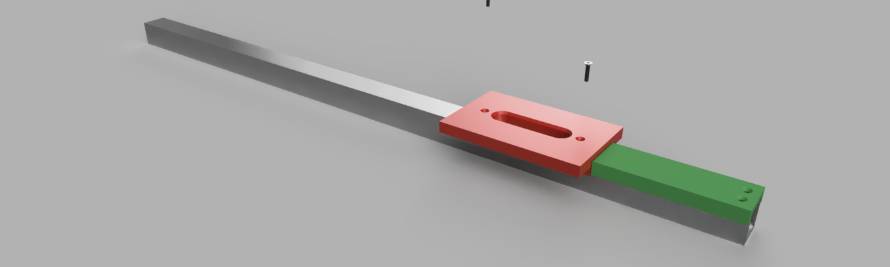
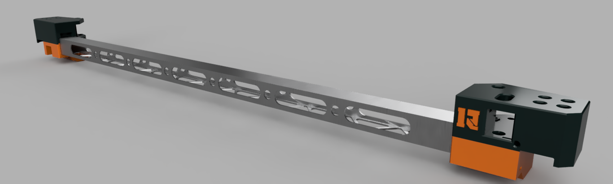

# The Gantry

## XY Motion System
Optimized for 15mm belts, the files found within this section will enable you to construct the xy motion system.  As a bonus I've uploaded step files to make editing for modifications easier for the community.

### DIY Aluminum Gantry Frame
The x-axis frame piece is constructed using 1" aluminum square tube with a wall thickness of 1/16".  Cutouts are made using 3d printed router templates.  Templates and how to use them: [gantry-router-templates.md](gantry-router-templates.md).

### Why 15mm belts?
Because of the tools that can be used with the Rhino motion system, I felt it best to go with some hefty belts.  In additional to a longer duty cycle benefits of these larger belts would include less resonance 
on the gantry which translates to higher quality 3d prints, smoother cuts when using the laser or spindle modules, and a quieter printer.

### How long should the belts be?
3 meters for each belt run, so 6 meters total will be needed.  It is also recommended to utilize dust-proof glass fiber core belts.

### Change History - new section
04-14-2023 - Uploaded a new design for the xy joiners, a design that I refer to as "The Bulkup Concept".  This came about after i began to notice sagging in previous design where the x-axis frame and xy joiner meet.  In addition I added extra material to the areas that contain the pulleys to account for excessive strain during belt tensioning.  This design has been tested for 3 months and is proving effective.

## In this folder

| Folder | What's there |
|---|---|
| (this folder) | XY joiners (left/right, top/bottom), Y endstop flag |
| [x-carriage](x-carriage/) | Carriage, Back Bone mount and bearing spacer |
| [stepper-mounts](stepper-mounts/) | A/B stepper mounts and Torque Buddy |
| [rear-center-idler](rear-center-idler/) | 15 mm rear centre idler and drawing |
| [belt-tensioner](belt-tensioner/) | Belt tensioner, cam and knob assemblies with drawings |

