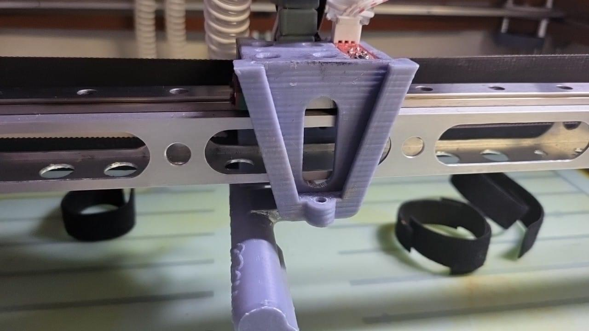

# Toolheads

<table><tr><td align="center"><a href="blockone/"><picture><source media="(prefers-color-scheme: dark)" srcset="blockone/images/blockone-dark.png"></picture></a></td><td align="center"><a href="switchfly/"><picture><source media="(prefers-color-scheme: dark)" srcset="switchfly/images/switchfly-dark.png"></picture></a></td><td align="center"><a href="lightsaber/"><picture><source media="(prefers-color-scheme: dark)" srcset="lightsaber/images/lightsaber-dark.png"></picture></a></td><td align="center"><a href="hotjoe/"><picture><source media="(prefers-color-scheme: dark)" srcset="hotjoe/images/hotjoe-dark.png"></picture></a></td><td align="center"><a href="dragknife/"><picture><source media="(prefers-color-scheme: dark)" srcset="dragknife/images/dragknife-dark.png"></picture></a></td></tr><tr><td align="center"><a href="blockone/"><b>BlockOne</b></a> 3D printing</td><td align="center"><a href="switchfly/"><b>SwitchFly</b></a> Dual-extrusion printing</td><td align="center"><a href="lightsaber/"><b>LightSaber</b></a> Laser</td><td align="center"><a href="hotjoe/"><b>HotJoe</b></a> CNC spindle</td><td align="center"><a href="dragknife/"><b>DragKnife</b></a> Drag knife</td></tr></table>

The Rhino uses swappable tools mounted to the X-carriage. A tool slides down into the V-groove on the front of the
carriage, which aligns it, and is held by one M3×50 bolt with a knurled nut (or wing nut).

| Slot | Tool | What it does | Folder |
|---|---|---|---|
| 1 | **BlockOne** | Single-extruder 3D printing (0.4 / 0.8 mm nozzles) | [blockone](blockone/) |
| 2 | **SwitchFly** | Two filaments, one stepper, one nozzle | [switchfly](switchfly/) |
| 3 | **LightSaber** | 80 W, 12 V blue diode laser - cutting and engraving | [lightsaber](lightsaber/) |
| 4 | **HotJoe** | 24 V brushless spindle with ER8 collet | [hotjoe](hotjoe/) |
| 5 | **DragKnife** | Passive drag knife for vinyl, cardstock, foam | [dragknife](dragknife/) |
| - | Jack Rabbit | Earlier print head, superseded by BlockOne | [jack-rabbit](jack-rabbit/) |

More tools (hot wire, needle cutter, pens, extra nozzle sizes) can be added from the
[Tool Manager](https://github.com/Makersmic/Toolhead_Manager) portal without editing config files.

## The umbilical and the Hub

Every tool ends in a male **21W4 D-sub** connector (four high-current contacts plus seventeen signal pins). The female
half is fixed at the top rear of the frame, with the **Hub** - a row of Wago-style terminal blocks - directly below it in
the cabinet. Because the mating point is at the rear, each tool carries only the wiring it needs.

| Contacts | Print heads | LightSaber | HotJoe | DragKnife |
|---|---|---|---|---|
| 1-2 | Hotend heater | - | - | - |
| 3-4 | Thermistor | Thermistor | Thermistor | Thermistor |
| 5-6 | Hotend fan | - | - | - |
| 7-10 | Extruder stepper | - | - | - |
| 11-12 | (SwitchFly: servo power) | - | 24 V power (relay) | - |
| 13-15 | Probe | Probe | Probe | Probe |
| 16-17 | - | Laser PWM | - | - |
| 18-19 | (SwitchFly: servo PWM) | - | Spindle PWM (ESC) | - |
| 20-21 | - | 12 V power (relay) | - | - |

**Constant connections** don't go through the umbilical; they run to the carriage through the Back Bone: X endstop
(3 wires), two 20 mm air tubes, the chamber thermistor and the LED strip.

### Why every tool has a thermistor

Klipper's extruder expects a temperature reading at all times. Rather than editing `printer.cfg` for every tool, each
tool carries the same thermistor type on contacts 3-4 (the laser's is on its heatsink). The swap wizard also reads it
to confirm the umbilical is seated.

## Swapping tools

Run `SWAP_TOOL` (a Mainsail button). It cools down, lowers the bed to a safe height, homes X/Y only - never Z with a
laser, spindle or knife on - and walks you through the swap with pop-ups. Sliced files name the tool they need, and a
job won't start if a different tool is mounted.
