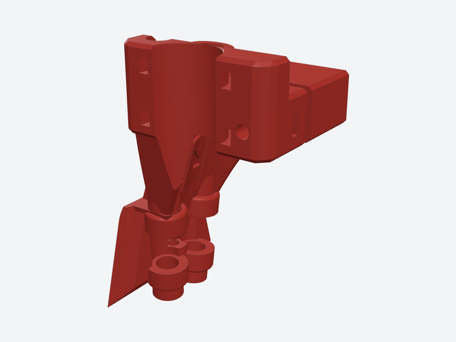

# DragKnife

<picture><source media="(prefers-color-scheme: dark)" srcset="images/dragknife-dark.png"></picture>

**Drag-knife cutting - vinyl, cardstock, thin foam** · slot 5 in the Tool Manager

A passive tool (formerly *Ostrich*) for Roland No. 9 and No. 10 blade holders. It has no power output: cut depth
comes from the blade dial and the Z zero set in the job wizard.

## Files

| File | What it is |
|---|---|
| `Ostrich Drag Knife.step` | Drag-knife holder |

## Tool connector (21W4)

Contacts this tool uses. Pins 1, 2, 11 and 12 are the high-current contacts. Full wiring: [electrical](../../electrical/).

| Contact | Use |
|---|---|
| 3 | Thermistor |
| 4 | Thermistor |
| 13 | Probe |
| 14 | Probe |
| 15 | Probe |

## Running it

- **Set up a job with:** `DRAGKNIFE_JOB_SETUP FILE=<name>.gcode`
- **Outputs in Klipper:** None (passive tool)
- **Macros:** `DRAGKNIFE_JOB_SETUP`

Config, macros and the Tool Manager portal live in **[Toolhead_Manager](https://github.com/Makersmic/Toolhead_Manager)**; the user manual there has a full chapter on each tool.
