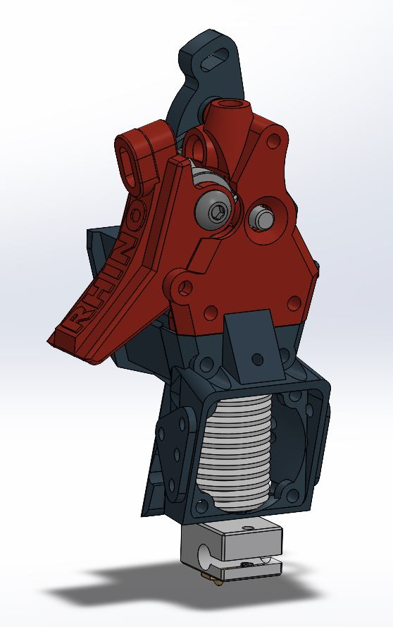

# Jack Rabbit (legacy)

> **Outdated - superseded by [BlockOne](../blockone/).** Kept for reference and for anyone who built one.

## Lightweight direct-drive 3D printing tool head
The Jack Rabbit utilizes the large drive gear and a single famous 'BMG' gear in combination with a 625zz bearing to feed filament to the nozzle.  Gears are driven by round body style nema 14 stepper motor with a 10 tooth gear.  Print speeds can be had at 200mm in conjunction with an E3D v6 volcano hotend.  

## Key features
- Lightweight
- 5:1 gear ratio
- Squeeze-trigger release for easier one-handed operation
- Part cooling from a 40 mm double delta fan
